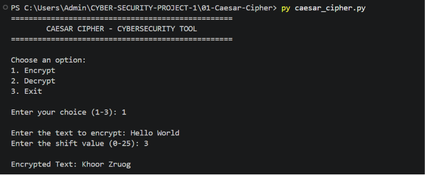
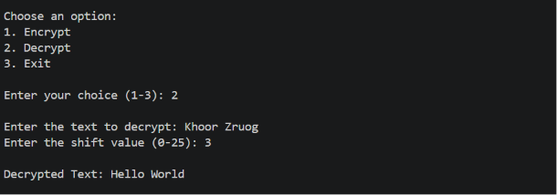
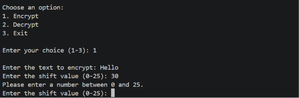

# 🔐 Caesar Cipher

A Python-based cybersecurity tool that demonstrates the fundamentals of classical cryptography using the Caesar Cipher technique.

## 📌 Project Overview

The Caesar Cipher is a classical substitution cipher in which each letter in a message is shifted by a fixed number of positions in the alphabet.

This project implements both encryption and decryption and provides a simple command-line interface for users to interact with the cipher.

## 🎯 Objective

The main objectives of this project are:

- Understand the fundamentals of encryption and decryption.
- Implement a classical cryptographic algorithm using Python.
- Understand how character shifting works.
- Handle both uppercase and lowercase letters.
- Preserve spaces, numbers, and special characters.
- Implement input validation.
- Demonstrate the limitations of classical encryption techniques.

## 🛡️ Cybersecurity Concept

This project demonstrates the concept of **cryptography**, specifically a **substitution cipher**.

The Caesar Cipher is useful for understanding basic encryption concepts, but it is **not considered secure for protecting real-world sensitive information** because there are only 26 possible shifts and the cipher can be easily broken using brute-force or frequency-analysis techniques.

## ⚙️ Features

- 🔐 Text encryption
- 🔓 Text decryption
- 🔢 Custom shift value
- 🔠 Uppercase and lowercase character support
- 🔤 Preservation of spaces
- 🔢 Preservation of numbers
- 🔣 Preservation of special characters
- 🛡️ Input validation
- 🔄 Interactive command-line menu
- ❌ Handles invalid user input

## 🧠 How It Works

For encryption, each alphabetic character is shifted forward by the specified shift value.

For example, with a shift value of `3`:

```text
A → D
B → E
C → F
## 📸 Screenshots

### Encryption

The program successfully encrypts the message using the selected shift value.



### Decryption

The program successfully decrypts the encrypted message back to its original form.



### Input Validation

The application handles invalid shift values and displays an appropriate error message.

